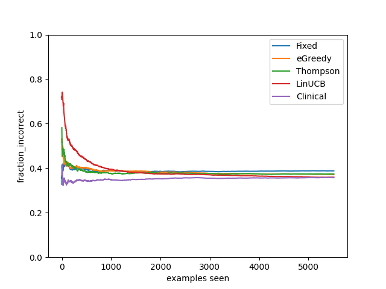

# Multi-Armed-Bandit-on-Dosage-Prediction
## Introduction
The repo is the assignment 4 from cs234 winter 2021 at Stanford University.  \
This project is motivated by the challenge of Warfarin dosing, and considers a simplification of this important problem, using real data. The goal of this question is to explore the performance of multi-armed bandit algorithms to best predict the correct dosage of Warfarin for a patient without a trial-an-error procedure as typically employed.
The problem is multi-class classification:
* Low warfarin dose: under 21 mg/week
* Medium warfarin dose: 21-49 mg/week
* High warfarin dose: above 49 mg/week

## Dataset
 You can find the data in warfarin.csv and metadata containing a description of each column in metadata.xls. Features of each patient in this dataset includes, demographics (gender, race, . . . ), background (height, weight, medical history, . . . ), phenotypes and genotypes.

## Algorithms
### Baselines
* Fixed-dose: This approach will assign 35mg/week (medium) dose to all patients.
* Warfarin Clinical Dosing Algorithm: This method is a linear equation based on age, height, weight, race and medications that patient is taking.
### Liner Upper Confidence Bandit Algorithm (LinUCB)
Implemented the Disjoint Linear Upper Confidence Bound (LinUCB) algorithm from Li et al. (2010)
### ε-greedy LinUCB
Include ε-greedy in LinUCB defined above.
### Thompson Sampling Algorithm
Implemented the Thompson Sampling for Contextual Bandits from Agrawal and Goyal (2013)

## Result

## Reference
S. Agrawal and N. Goyal. Thompson sampling for contextual bandits with linear payoffs. In International Conference on Machine Learning, pages 127–135, 2013. \
L. Li, W. Chu, J. Langford, and R. E. Schapire. A contextual-bandit approach to personalized news article recommendation. In Proceedings of the 19th international conference on World wide web, pages 661–670, 2010.